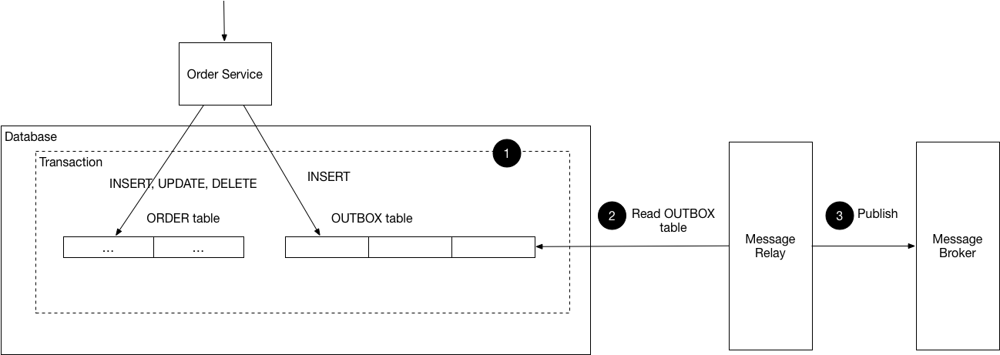

# Inleiding

We voegen één patroon toe aan de reeks patronen rond microservices. Zorg dat het vorige labo eerst is afgewerkt.

# Vereiste theorie

- kennis Docker Compose van DevOps of Cloudsystemen
- les 3 rond message queues
- les 7 rond microservices

# Opdrachten

## Transactional outbox
Een probleem met de eerdere oefeningen is het feit dat aanpassingen in de database misschien niet alle geïnteresseerde partijen bereiken. Maar een update aan de database kan niet in één transactie worden gebundeld met het publishen van een bericht naar een message broker.

## Oefening
Wat je *wel* kan doen is de updates aan je database expliciet bijhouden, zoals in event sourcing. Dat kan bovendien in één transactie gebeuren met de aanpassingen aan je database, dus lokaal bijhouden dat een aanpassing gebeurd is, is wel mogelijk.

Door een extra dienst te voorzien die regelmatig onverzonden berichten uitleest, kan je zorgen dat alles uiteindelijk bij de broker terecht komt. De updates aan je tabel worden dus in een soort "outbox" bijgehouden. Je ziet dit op . De message relay kan expliciet gecontacteerd worden, of hij kan periodiek controleren of er nog onverzonden berichten zijn. Wanneer hij opmerkt dat er onverzonden berichten staan, stuurt hij ze door naar de message broker.

Dit vereist wel dat berichten idempotent zijn. Dat wil zeggen dat het niet erg is als een bericht twee keer verzonden wordt. De reden is dat ook de message broker zou kunnen falen na het verzenden van een bericht, maar voor het markeren ervan in de database. Dit is vrij eenvoudig op te lossen, bijvoorbeeld door berichten te nummeren. Voor inspiratie kan je eens opzoeken hoe het TCP-protocol berichtnummers gebruikt als bevestiging.

Zorg eerst dat de eigenlijke wijzigingen aan je database en de "hogere orde" voorstellingen in een transactie gebundeld zijn. Voorzie dan zelf een message relay die om de 10 seconden controleert op onverzonden berichten en deze allemaal doorstuurt naar de broker. Voeg ook code toe om verschillende stappen in het systeem een exception te laten gooien in een klein aantal (pakweg 10%) van alle gevallen nadat je een bericht naar de broker hebt gestuurd maar voor je het als verzonden hebt gemarkeerd. Zo zal je snel merken of het systeem echt foutbestendig is.
