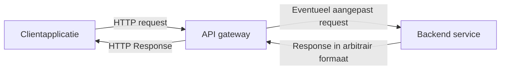
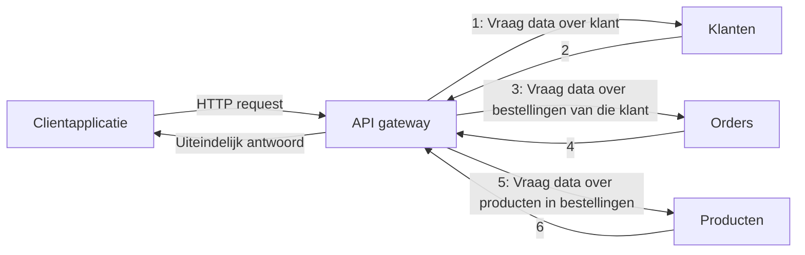

# Inleiding

Een belangrijke vraag bij het ontwikkelen van een architectuur gebaseerd op microservices is hoe coördinatie over meerdere diensten best wordt afgehandeld. In dit labo zullen we een aantal typische architecturale patronen voor microservices implementeren in Docker Compose.

Als je aandachtig leest, vind je vast ook enkele nadelen of technische uitdagingen terug voor deze patronen. Dat is normaal. Het illustreert de eerste wet van de softwarearchitectuur.

Er zijn vier opdrachten voorzien, maar waarschijnlijk wordt de vierde wat te veel voor het eerste labo rond microservices. Ze staat er al voor als het vlot gaat.

# Vereiste theorie

- kennis Docker Compose van DevOps of Cloudsystemen
- les 3 rond message queues
- les 7 rond microservices

# Opdrachten

## API gateway voorzien
Een microservice houdt zich gericht bezig met één deeldomein. Informatie uit dat domein presenteren aan een externe consument brengt een hoop extra taken met zich mee (authenticatie, foutboodschappen, retrylogica,...). Bovendien is de interface voor communicatie met andere microservices meestal niet ideaal voor communicatie met externe consumenten.

Dit wordt typisch opgelost door een *API gateway*. Als je ooit van het *[Facade](https://refactoring.guru/design-patterns/facade)* design pattern hebt gehoord, zal dit bekend voorkomen. Het idee is dat je een aparte microservice voorziet, bedoeld voor communicatie met externen. Deze service is dan een "tussenpersoon" tussen de externe consument en de andere microservices. Een reverse proxy kan (eventueel mits gebruik van allerlei middleware) deze taak vervullen, maar de eerste verantwoordelijkheid van een reverse proxy is inkomend verkeer routeren. De taak van een API gateway is gebruik van achterliggende API's beheren. Het kan zijn dat je een reverse proxy opzet met daarachter een API gateway, bijvoorbeeld omdat de gateway slimmere authenticatie, userspecifieke rate limiting,... kan ondersteunen.

### Oefening
Zorg, zonder de code van de "customers"-applicatie aan te passen, dat een gegeven client altijd één van drie vaste geheimen moet meesturen om een antwoord te krijgen en dat er een rate limit is waarbij elk geheim maar twee keer per minuut gebruikt kan worden.

Gebruik een andere programmeertaal dan zuivere JavaScript (waarin de voorziene applicaties geschreven zijn). Dit mag TypeScript zijn, maar het mag ook C♯, Python, Java,... zijn.

### Aanvullend
In de oefening hebben we zelf een gateway verzonnen. Er zijn specifieke tools voor, zoals [Kong](https://konghq.com/products/kong-gateway). Merk trouwens op dat deze tool voortbouwt op NGINX, dus de reverse proxy is eigenlijk gebundeld.

## API composition
Het kan zijn dat externe consumenten informatie nodig hebben die verspreid zit over meerdere services. Op een webwinkel zie je misschien tegelijk informatie die beheerd wordt door een "klanten"-service, een "bestellingen"-service en een "producten"-service. Mogelijk is deze informatie ook gelinkt aan elkaar. In een relationele database zouden we een `JOIN` gebruiken, maar omdat elke microservice een eigen database heeft, is dat geen mogelijkheid. Daarom doet een API gateway vaak aan "API composition": hij verzamelt informatie uit de verschillende achterliggende services en voert zelf de "`JOIN`" uit.

### Oefening
Zorg dat de gateway data voor een productoverzichtspagina kan leveren. Je mag de code voor het geheim en de rate limiting verwijderen (plaats ze wel in versiebeheer). Je stuurt naar de API gateway een verzoek in JSON-formaat met daarin het e-mailadres van een klant. Wat je terugkrijgt is de bestelgeschiedenis. Deze bevat onder andere:

- de naam van de klant
- een lijst met bestellingen, met per bestelling
  - de datum van de bestelling
  - de naam van het product
  - de **huidige** prijs

## Event sourcing
In microservices gaan updates aan het domein heel vaak gepaard met het versturen van berichten. Als er bijvoorbeeld een aparte dienst is voor auditing, moet die bij domeinupdates gewijzigd worden. Als we gedistribueerde transacties willen uitvoeren ("saga's", zie volgend labo), moeten iedere betrokken partij ook bevestigen dat ze haar deel gedaan heeft. En als een transactie faalt, moeten we weten hoe we een rollback doen.

Dit maakt het een goed idee om domeinen of domeinobjecten te zien als reeksen van wijzigingen. We zien bijvoorbeeld een databasetabel als een genummerde reeks `INSERT`s, `DELETE`s en `UPDATE`s, eerder dan als een momentopname. We zeggen dat de tabel een "aggregate" is, opgebouwd door een reeks van "events".

Event sourcing houdt in dat we deze events ook opslaan, eerder dan (alleen) het eindresultaat. Als het duur is om het eindresultaat te berekenen uit de sequentie van events, kunnen we nog steeds kiezen om het eindresultaat te cachen.

### Oefening
Pas de services aan zodat `INSERT`s, `DELETE`s en `UPDATE`s binnen het domein letterlijk worden bijgehouden. Uiteraard kan dit enkel voor de operaties binnen het domein, want je hebt hier extra `INSERT`s voor nodig. Die gaan niet over het domein.

Breid vervolgens de vorige opdracht uit, zodat naast de huidige prijs ook de prijs wordt gegeven op het moment dat de bestelling werd geplaatst.

### Aanvullend
Je kan event sourcing conceptueel wat vergelijken met het gebruik van Git voor versiebeheer. We zien de huidige toestand van ons project, als een opeenvolging van wijzigingen vanaf de root van de commit log. Intern is de implementatie wat anders, hebben we branches en rebases enzovoort, stellen commits geen "domeinwijziging" voor, maar het bekijken van de huidige toestand als een opeenvolging van wijzigingen is wel het kernprincipe achter event sourcing.

Een andere manier om dit te bekijken is als een architecturale versie van het *[Command](https://refactoring.guru/design-patterns/command) pattern*.

## CQRS
API composition is conceptueel eenvoudig, maar vermenigvuldigt het aantal leesoperaties. Als elk request op de API gateway bijvoorbeeld gemiddeld drie diensten contacteert, doen we 300% meer leesrequests dan als we onze vraag rechtstreeks konden stellen.

*Command Query Responsibility Segregation* (CQRS) kan dit oplossen wanneer de queries *read only* zijn. Deze techniek houdt in dat we het uitvoeren van domeinwijzigingen (de "commands") loskoppelen van het bekijken van de resultaten (de "queries"). Waarschijnlijk ken je het concept van een "database view" en heel misschien ken je ook een "materialized view" bij relationele databanken. Het verschil tussen die twee is dat een normale view eigenlijk een wrapper is voor een complexe `SELECT`-query, terwijl een materialized view de resultaten van die complexe `SELECT`-query opslaat.

CQRS is vergelijkbaar. We slaan het resultaat op van een query die we we anders via API composition zouden uitvoeren. Iedere keer zich in het systeem een event voordoet dat dit resultaat zou beïnvloeden, sturen we via een message broker een update naar de dienst die anders de compositie zou doen.

CQRS wordt heel vaak gebruikt in combinatie met event sourcing. Je verwittigt de dienst die de queries afhandelt van de **update** in het domein, niet van de huidige toestand van het hele domein. Je kan hierbij wel details achterwege laten die niet relevant zijn voor de service die de queries afhandelt.

### Oefening
Herschrijf de vorige opdracht zodat de data voor het klantenoverzicht rechtstreeks van de API gateway kan komen. Dezelfde domeinoperaties die je voor het stukje event sourcing opslaat, moet je dus via een message broker tot bij de API gateway krijgen. Er is nog geen message broker aanwezig, maar je hebt in een eerder labo RabbitMQ gezien.

### Aanvullend
CQRS kan alleen werken als updates over het domein uiteindelijk altijd aankomen. Dit is niet vanzelfsprekend: we kunnen geen update sturen voor de domeinwijziging persistent gemaakt is (want het kan mislopen), maar we kunnen ook geen update sturen nadat de domeinwijziging persistent gemaakt is (want tussen beide stappen kan de service crashen). Hier bestaan oplossingen voor die volgend labo bekijken.

Merk ook op dat we hier "eventual consistency" hebben tussen het domein en de "view". Het kan zijn dat iets al gewijzigd is in het domein, maar dat die update nog niet weerspiegeld wordt bij de consumer.
