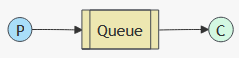
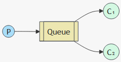
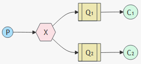
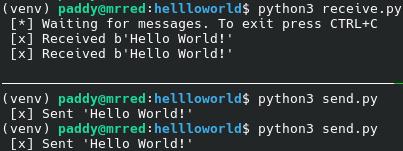
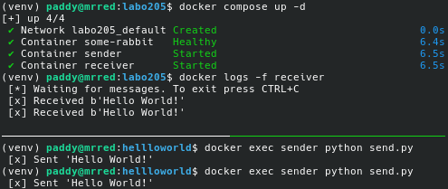

Repository voor labo oefeningen bij OLOD ICT Architecture

# Labo 5 (bis jaar)
In dit labo worden enkele patronenen voor werken met messages overlopen ahv RabbitMQ tutorials.

**Tutorial 1 - Hello World** 

**Tutorial 2 - Work Queues** 

**Tutorial 3 - Publish/Subscribe** 

## Gebruik - Hello World
Elke keer dat de zender (`sender.py`) wordt uitgevoerd stuurt deze een bericht naar de queue van de RabbitMQ server. De ontvanger (`receiver.py`) toont elk nieuw bericht dat op de queue aankomt.

### Lokaal
RabbitMQ server container opzetten 
`docker compose up -d rabbitmq`

Python packages installeren 
`pip install -r requirements.txt`

reciever starten (aparte terminal) 
`python3 helloworld/receiver.py`

een bericht versturen 
`python3 helloworld/sender.py`

**Voorbeeld** 

### Docker service stack
Docker service stack opzetten 
`docker compose up -d`

logs receiver service volgen 
`docker logs -f receiver`

een bericht versturen (aparte terminal) 
`docker exec sender python send.py`

**Voorbeeld** 

